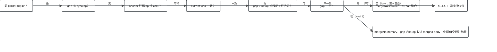
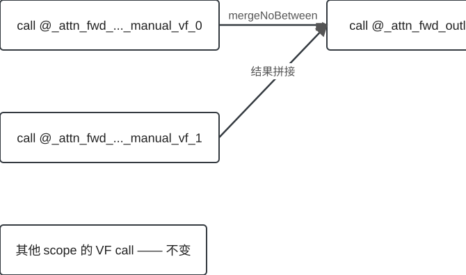
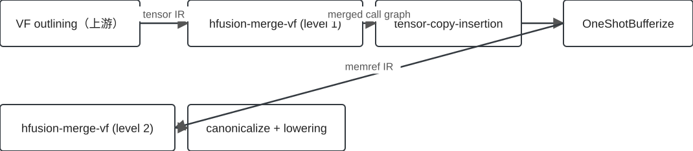

## 为什么存在？VF call 的调度开销

::: columns
::: {.column width="60%"}
kernel 被 outline 成许多小 vector function（VF），vector core **每次 call 都要付一次调度开销**；小 kernel 上，这笔开销占主导。

`hfusion-merge-vf` 的回答：把 call 相邻的 VF 对**融成一个 merged VF**，调度成本只付一次。
:::
::: {.column width="38%"}
::: {.callout-note appearance="simple"}
## 输入形态
一个 non-VF root 函数 + 若干 `hivm.vector_function` 标记的 callees。
:::
:::
:::

## 核心想法：相邻 VF call 融合

> 把 call 相邻的 vector-function 调用融合为一个 merged vector function，由依赖与内存效应分析证明安全性；并按 merge-level 二选一：bufferize 之前融合 tensor 级 VF，之后融合 memref 级 VF。

- 安全性**靠证明**：任何一道门不过就跳过该对（不是猜，也不是失败）
- 每个改写产物自验证：`mergedFunc.verify()` 失败即 `signalPassFailure`

## 怎么找到候选对：排序 → 依赖事实 → 打分

1. **排序**：VF 按 root 中的首次 call 顺序排列（程序序）
2. **依赖事实**：同块 SSA 依赖 + 同块 memref 读写依赖（别名并集）→ 传递闭包
3. **打分**：前向使用矩阵；无依赖的 VF 优先尝试；VF 依赖图维护正反向边
4. **贪心循环**：取 call 相邻对尝试融合，成功后 merged VF 重新入队

::: {.callout-tip appearance="simple"}
## 证据
以上 stage 均有 `file:line` 溯源（dossier `mechanism.stages`），融合循环与改写另由 L1/L2 fixture 实测佐证。
:::

## 合法性门：全过才改写

{.diagram .diagram-wide}

任何一门不过 → **REJECT（跳过该对）**；level 1 额外要求 gap 已清空。

## 实例：L1 fixture 实测

{.diagram .diagram-wide}

`bishengir-opt --hfusion-merge-vf=merge-level=1` 实际执行 attention fixture：

- 两个相邻 tensor 级 VF call → 一个 `%11:4 = call @_attn_fwd_outlined_merged_merged_vf_0`（4 结果，`ptc_simdvf`）
- 同文件其他 scope 的 VF **保持原样**（level 1 跳过依赖相关对）

## 两种策略：L1 / L2

{.diagram .diagram-wide}

| | L1（tensor 级，bufferize 前） | L2（memref 级，bufferize 后） |
|---|---|---|
| 门 | `enableVfMergeLevel == 1` | `enableVfMergeLevel == 2` |
| 候选 | 仅无依赖相邻对 | 任意相邻对（计数上限内） |
| 证据形态 | tensor IR，fixture 融合出 4 结果 call | memref IR，merged VF 带 11 参 / 4 结果 |
| 取舍 | bufferization 看到更小 call graph | 具体 memref 别名信息，覆盖更广 |

## 边界：支持什么、拒绝什么

- **支持**：同 region、extract kind 兼容的相邻对融合（L1 限无依赖对，L2 计数上限内）
- **设计上拒绝**：gap 内 sync op；会重排 anchor ID 的改写；extract kind 不匹配（double buffering）
- **部分支持**：跨块内存依赖不可见（同块扫描），部分合法合并被拒 —— MVS-002
- **未知**：超过 2 链式融合的形状没有测试覆盖

## 风险与已知发现

::: {.callout-warning appearance="simple"}
## MVS-001（correctness，open）
"每个 VF 只被调用一次"**只是注释假设，无守护约束**：多调用点 VF 可能基于错误依赖数据被合并（A5 移植带入，medium 回归风险）。
:::

::: {.callout-warning appearance="simple"}
## MVS-002（opportunity，open）
跨块 memref 依赖扫描缺失，attention 形 root 上的合法跨块合并被放弃。
:::

## 总结

- 融合相邻 VF call，**摊销** vector core 每次的调度开销
- 安全性靠**门级联**证明：extract kind / 同 region / 无 sync / anchor 钉死 / gap 可移动
- merge-level 是**两个策略**：L1 tensor 级（bufferize 前）、L2 memref 级（bufferize 后）
- gap 处理是难点：sync/anchor 是硬拒绝，可移动内存 op 要么挪走要么收进 merged body
- 已知边界：MVS-001（单调用假设无守护）、MVS-002（跨块覆盖缺口）

## 附录：证据索引

::: {.callout-note appearance="simple"}
本 deck 消费 READY PresentationHandoff（subject: mergevecscope-pass，head `90037fe33`）。slide → storyline step → evidence id 的完整追溯见 `presentation-manifest.json`（consumed.evidence_ids）与 bundle 的 evidence ledger。
:::
