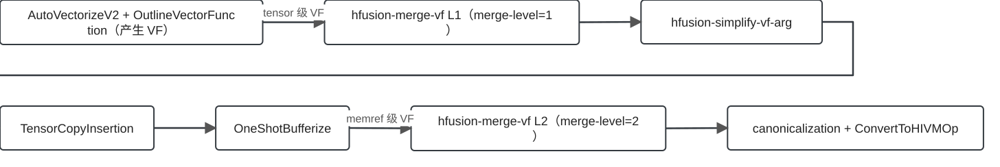
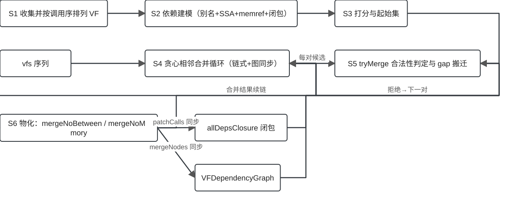
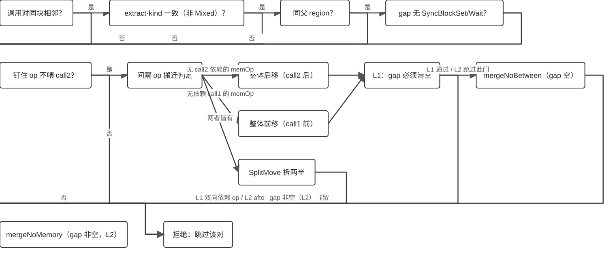
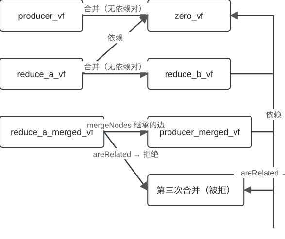
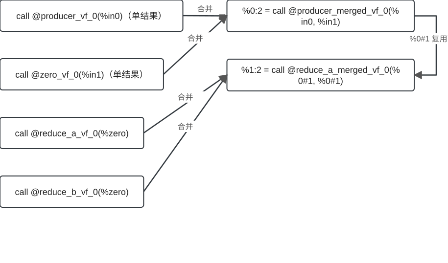

## 为什么需要 MergeVecScope？

::: {.claim}
AutoVectorizeV2 把融合组拆成许多小 VF，每个 VF 边界都是一次经内存的 buffer 往返——调度开销随 VF 数量线性增长。
:::

- 合并相邻 VF 调用对 → 摊薄边界开销、缩短调度队列
- `hfusion-merge-vf`：module 级 transform pass，在 regbase bufferization 流水线中跑两次

::: footer
证据：`Passes.td:719-732` · EV-001 / EV-003
:::

## 一句话心智模型

::: {.claim}
相邻 VF 调用对 → 合并成一个大 VF 函数；merge-level 一档控制力度（1 = 只合无依赖对，2 = 折叠间隔代码）。
:::

- 三份跨迭代状态：**vfs 序列**、**allDepsClosure 闭包**、**VFDependencyGraph**
- 每次成功合并都必须同步依赖图——否则重演陈旧图错合并（P15）

::: footer
证据：`MergeVecScope.cpp:469-823` · EV-013 / EV-014
:::

## 两个合并窗口

{.diagram .diagram-wide}

- L1 在 bufferize **前**合 tensor 级 VF（一套 buffer）
- L2 在 bufferize **后**合 memref 级 VF（可折叠间隔代码）

::: footer
证据：`HIVMRegbasePipelines.cpp:222-276` · `PassPipeline.cpp:108-111` · EV-028 / EV-029
:::

## 机制总览：依赖模型与三份状态

{.diagram}

- 依赖建模：别名分析 + 同块 SSA 边 + 同块 memref 效应
- 打分：后者调用者依赖前者 → 不进 0 分起始集
- 贪心：候选恒为调用序右邻，成功后链式续合并

::: footer
证据：`MergeVecScope.cpp:534-823` · EV-006 ~ EV-014
:::

## 打分与贪心合并循环

- `useScoreMat[i][j]`：vf_j 的调用者是否传递依赖 vf_i 的调用者
- 0 分 VF 用 `stable_partition` 排前（`useIncrIdx`）
- 每轮只看右邻；`tryMerge` 成功 → `mergeNodes` 图同步 → 链式续合并

::: footer
证据：`MergeVecScope.cpp:631-823` · EV-011 ~ EV-014
:::

## tryMerge：一票否决闸门链

{.diagram}

- 同块相邻 → 同父 region → extract-kind 一致 → 无同步指令 → 锚点钉住
- 宁可漏合，不可错合：任一闸门触发即放弃该候选对

::: footer
证据：`MergeVecScope.cpp:849-1104` · EV-015 ~ EV-023
:::

## 物化：mergeNoBetween 与 mergeNoMemory

{.diagram .diagram-wide}

- gap 空 → `mergeNoBetween`：纯拼接两个函数体
- gap 非空（L2）→ `mergeNoMemory`：把间隔 memref 操作折进函数体
- `patchCalls` 改写调用点并删除旧 VF

::: footer
证据：`MergeVecScope.cpp:1285-1629` · `1106-1163` · EV-025 ~ EV-027
:::

## 实测实例：dependency-update

{.diagram .diagram-wide}

- 四次合并机会里只发生两次正确合并
- `CHECK-NOT producer_merged_merged_vf` 断言第三次错合并不存在
- 真实输出 IR 由本会话 `bishengir-opt --hfusion-merge-vf=merge-level=1` 运行采集

::: footer
证据：`bishengir/test/Dialect/HFusion/hfusion-merge-vf-dependency-update.mlir` · EV-033 / EV-034
:::

## Worked example：依赖图演化推演

::: {.small}
1. **依赖建模** — SSA 依赖只建同块边：reduce_a→zero、reduce_b→zero（%zero 是二者操作数），producer 无边；闭包后 `isDep(reduce_a, zero)=true`
2. **打分** — 依赖对不进 0 分起始集：0 分 VF = {producer, reduce_a, reduce_b}，候选恒为调用序右邻
3. **贪心第 1 轮** — producer 与右邻 zero 双向 areRelated=false → tryMerge 成功 → `@producer_merged_vf_0`；`mergeNodes` 并组重连边
4. **贪心第 2 轮** — reduce_a 与 reduce_b 的依赖都指向已合并组之外 → tryMerge 成功 → `@reduce_a_merged_vf_0`
5. **反证收尾** — 若无 mergeNodes 图同步，陈旧边会把 producer 组与 reduce 组再次错合并出 `@producer_merged_merged_vf`；测试以 CHECK-NOT 断言其不存在
:::

::: footer
证据：EV-007 / EV-010 / EV-011 / EV-012 / EV-013 / EV-014（实例实测，kind=test）
:::

## Worked example：闸门链逐门推演

::: {.small}
1. **同父 region 门** — `getParentRegion()` 不同 → 直接拒绝（跨 region 改写为设计拒绝）
2. **同步指令门** — gap 收集跳过 AnchorOp；出现 `SyncBlockSetOp` / `SyncBlockWaitOp` → 拒绝
3. **extract-kind 门** — 结果按 tensor.extract 直接消费分类；Extracted / NotExtracted 不匹配 → 拒绝
4. **L1 残留门** — 搬迁后重新收集 gap，仍有可移动 op 残留 → 拒绝（钉住的锚点 op 允许留守）
5. **全过 → 物化** — 按 gap 形态走 mergeNoBetween 或 L2 折叠，物化合并函数并改写调用
:::

::: footer
证据：EV-016 / EV-017 / EV-018 / EV-019 / EV-023 / EV-025 / EV-020（源码事实推演，kind=reconstructed）
:::

## 能力范围

::: columns
::: {.column width="50%"}
::: {.good}
**✔ 支持（实测）**

- L1：无依赖相邻 VF 对合并（含链式）
- L2：折叠间隔内存 / 标注 op 进函数体
- extract-kind 敏感合并
:::

::: {.warn}
**◐ 部分支持**

- 带锚点 gap：锚点留守、含锚点 op 钉住
- 钉住结果喂 call2 仍拒绝
:::
:::
::: {.column width="50%"}
::: {.danger}
**✘ 设计拒绝**

- 跨父 region 的调用对
- gap 含同步指令
- extract-kind 不匹配
- L1 搬迁后仍有可移动残留
:::

::: {.danger}
**✘ 未支持**

- 跨块 / region 持有的深层依赖（P3）
- 多调用者 VF（P1）
:::
:::
:::

::: {.muted .small}
**? 未知**：`ptc_simdvf` 的仓库外消费者语义；生产中是否存在多调用者 VF
:::

::: footer
证据：`MergeVecScope.cpp:849-1104` 边界逐条核对 · EV-016 ~ EV-023
:::

## 已知风险

| 问题 | 证据 | 后果 | 优先级 |
|---|---|---|---|
| 多调用者 VF 悬空 | 机制确认 | 第二调用者指向已删函数 | **P1** |
| 属性不对称 | 实测 | 合并结果缺 hivm.func_core_type | **P2** |
| 跨块依赖欠覆盖 | 代码审读 | 理论过合并 | **P3** |
| 链式合并超上限 | 压测复现 | 合并组超出上限后崩溃 | **P4** |
| hivmc 镜像缺脚本 | 仓库核对 | A5 侧构建分歧 | **N3** |

::: footer
证据：dossier risks 逐条 · EV-033 / EV-034 / EV-041 ~ EV-043
:::

## 总结

- 两个窗口：L1 在 bufferize 前合 tensor 级 VF，L2 在其后合 memref 级 VF
- 三份状态：依赖闭包、分数矩阵、依赖图——每次合并后必须同步
- 一串闸门：tryMerge 一票否决，宁可漏合不可错合
- 两种物化：mergeNoBetween 纯拼接；mergeNoMemory 折叠间隔代码
- 五个风险：P1 悬空符号、P2 属性不对称、P3 跨块欠覆盖、P4 链式超限、N3 镜像分歧

::: footer
证据：dossier key_takeaways · 全部条目见 evidence ledger
:::
