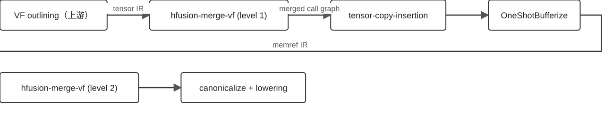
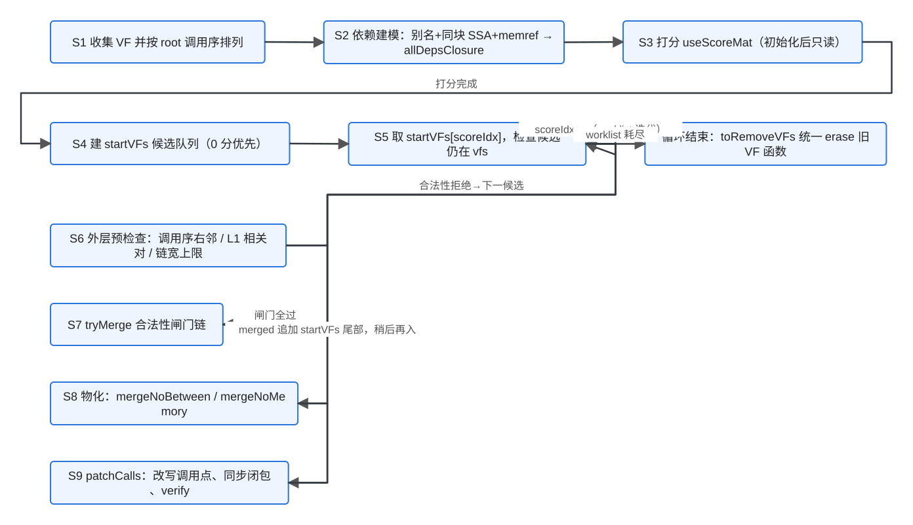
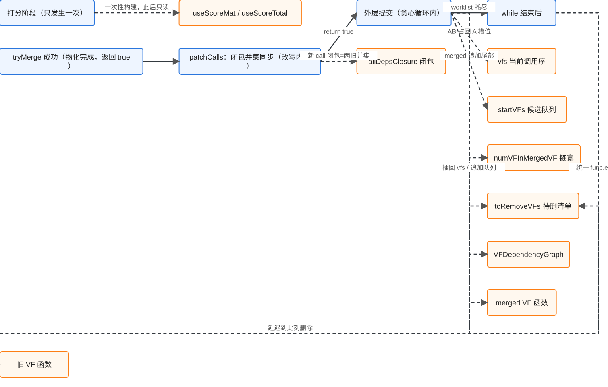
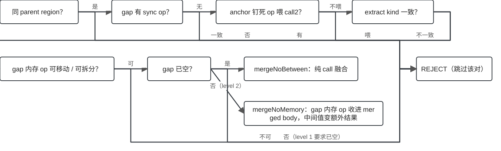
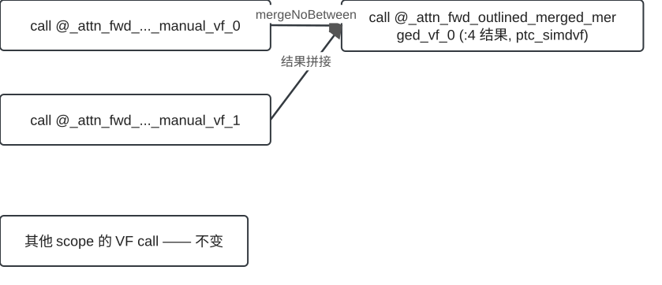
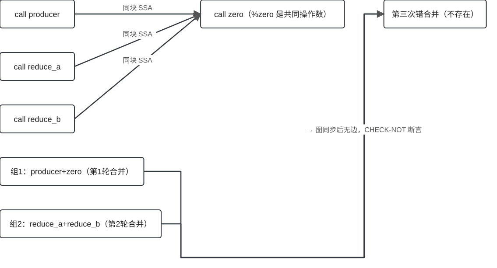

## 为什么需要 MergeVecScope？

::: {.claim}
AutoVectorizeV2 把融合组拆成许多小 VF，每个 VF 边界都是一次经内存的 buffer 往返——调度开销随 VF 数量线性增长。
:::

- 合并相邻 VF 调用对 → 摊薄边界开销、缩短调度队列
- `hfusion-merge-vf`：module 级 transform pass，在 regbase bufferization 流水线中跑两次

::: footer
证据：`Passes.td:719-732` · EV-001 / EV-003
:::

## 一句话心智模型

::: {.claim}
相邻 VF 调用对 → 合并成一个大 VF 函数；merge-level 一档控制力度（1 = 只合无依赖对，2 = 折叠间隔代码）。
:::

- 两个序列要分清：**startVFs 是候选 worklist**（L1 只收 0 分 VF），**vfs 是当前调用序 live 状态**
- 成功合并不是立即递归：merged VF 追加到 startVFs 尾部，等轮到它再处理
- 依赖闭包与依赖图每次成功合并后同步；分数矩阵初始化后只读

::: footer
证据：`MergeVecScope.cpp:769-823` · EV-025 / EV-026 / EV-029
:::

## 两个合并窗口

{.diagram .diagram-wide}

- L1 在 bufferize **前**合 tensor 级 VF（一套 buffer）
- L2 在 bufferize **后**合 memref 级 VF（可折叠间隔代码）

::: footer
证据：`HIVMRegbasePipelines.cpp:222-276` · EV-012
:::

## 机制总览：一次性分析 → 候选循环 → 成功提交

{.diagram .diagram-wide}

- 七个源码阶段各有其位：收集排列 → 依赖建模 → 打分 → 候选队列 → 贪心调度 → 预检查 → 闸门 → 改写 → **维护与自检（显式阶段）**
- 两段拒绝分清：外层预检查失败（skip）发生在 tryMerge **之前**；闸门拒绝（reject）在 tryMerge **之内**
- worklist 耗尽后才删除旧 VF 函数

::: footer
证据：`MergeVecScope.cpp:469-861` · EV-002 / EV-006 / EV-007 / EV-008 / EV-025 / EV-030
:::

## 一次成功合并后：哪些状态发生变化？

{.diagram .diagram-wide}

- `allDepsClosure` 在 **patchCalls 内**同步（新 call 闭包 = 两旧并集，引用条目原位重指向）
- `vfs` / `startVFs` / `numVFInMergedVF` / `toRemoveVFs` / `VFDependencyGraph` 在 **外层提交**更新
- `useScoreMat` / `useScoreTotal`：初始化打分时一次性构建，**此后只读**——不是每轮合并重算的状态
- 旧调用在 patchCalls 内擦除；旧 **VF 函数**延迟到 while 结束后统一 `func.erase`

::: footer
证据：`MergeVecScope.cpp:772-823, 1145-1160` · EV-025 ~ EV-030
:::

## Worked example：贪心链式合并（A+B 成功后）

::: {.small}
1. **初始** — `vfs=[A,B,C]`，`startVFs=[A,B,C]`，`scoreIdx=0` → 取候选 A
2. **定位右邻** — A 仍在 vfs 且非末尾 → 在 **live 序列**里定位右邻 vf2=B
3. **合并成功** — AB 占回 A 的槽位 → `vfs=[AB,C]`
4. **外层提交** — `startVFs=[A,B,C,AB]`，`toRemoveVFs=[A,B]`，`numVFInMergedVF[AB]=2`，图 mergeNodes
5. **关键：再入而非递归** — AB 此刻不与 C 合并；`scoreIdx++` 前进，轮到 AB 时在当前 `vfs=[AB,C]` 重新定位，候选变成 AB+C
6. **收尾** — worklist 耗尽后 `toRemoveVFs` 统一 erase
:::

::: footer
证据：`MergeVecScope.cpp:772-823` · EV-025 ~ EV-027 / EV-030（推演，kind=reconstructed）
:::

## 打分与贪心合并循环

- `useScoreMat[i][j]`：vf_j 的调用者是否传递依赖 vf_i 的调用者（初始化期构建）
- 0 分 VF 用 `stable_partition` 排前，进入 startVFs；L1 起始集只收 0 分 VF
- 每轮取 `startVFs[scoreIdx]`：先查候选仍在 **vfs**（live 序列）里，再定位当前右邻
- 成功 → `startVFs.push_back(merged)` 尾部再入；失败/跳过 → 仅 `scoreIdx++`

::: footer
证据：`MergeVecScope.cpp:631-812` · EV-006 / EV-007 / EV-025 / EV-030
:::

## tryMerge：两段拒绝，一票否决

{.diagram}

- **tryMerge 之前**（外层）：候选已不在 vfs / 已是调用序末尾 / L1 图上相关 / 链宽超限 → 直接跳过
- **tryMerge 之内**：同块相邻 → 同父 region → extract-kind 一致 → 无同步指令 → 锚点钉住
- 宁可漏合，不可错合：任一闸门触发即放弃该候选对

::: footer
证据：`MergeVecScope.cpp:727-812, 849-1104` · EV-007 / EV-008 / EV-020 / EV-028
:::

## 物化与延迟删除

- gap 空 → `mergeNoBetween`：纯拼接两个函数体
- gap 非空（L2）→ `mergeNoMemory`：把间隔 memref 操作折进函数体
- `patchCalls`：改写调用点、**同步 allDepsClosure**、擦除旧 **call**
- 旧 **VF 函数**不在此刻删除：收集进 `toRemoveVFs`，while 循环结束后统一 `func.erase`

::: footer
证据：`MergeVecScope.cpp:1106-1163, 787-823` · EV-009 / EV-010 / EV-027 / EV-029
:::

## 实测实例：dependency-update

{.diagram .diagram-wide}

- 两次相邻 tensor 级 VF call → 一个 4 结果的 merged call（真实执行）
- 其他 scope 的 VF call 保持原样

::: footer
证据：`bishengir/test/Dialect/HIVM/RegBase/merge-vf-level-1.mlir` · EV-015 / EV-017
:::

## Worked example：依赖图演化推演

{.diagram}

::: {.small}
1. **依赖建模** — 同块 SSA 依赖：reduce_a→zero、reduce_b→zero；producer 无边；闭包后 `isDep(reduce_a, zero)=true`
2. **打分** — 依赖对不进 0 分起始集；0 分 VF = {producer, reduce_a, reduce_b}
3. **贪心第 1 轮** — producer 与右邻 zero 双向 areRelated=false → tryMerge 成功；`mergeNodes` 并组重连
4. **贪心第 2 轮** — reduce_a 与 reduce_b 的依赖都指向已合并组之外 → 再次成功
5. **反证收尾** — 若无 mergeNodes 图同步，陈旧边会把两组再次错合并；自检 verify 是最后一道防线
:::

::: footer
证据：EV-005 / EV-006 / EV-007 / EV-019 / EV-011（推演，kind=reconstructed；配图为示意）
:::

## Worked example：闸门链逐门推演

::: {.small}
1. **相邻扫描** — root walk 找 vf1 的 call 后第一个同类 call；找不到相邻 call2 → 拒绝
2. **同父 region 门** — `getParentRegion()` 不同（跨 scf.if/scf.for）→ 拒绝
3. **同步指令门** — gap 中出现 `SyncBlockSetOp` / `SyncBlockWaitOp` → 拒绝
4. **extract-kind 门** — 结果按 tensor.extract 消费分类；不匹配 → 拒绝（double-buffering 保护）
5. **全过 → 物化** — 按 gap 形态走 mergeNoBetween 或 mergeNoMemory
:::

::: footer
证据：`MergeVecScope.cpp:849-1104` · EV-008 / EV-020（推演，kind=reconstructed）
:::

## 能力范围

::: columns
::: {.column width="50%"}
::: {.good}
**✔ 支持（实测）**

- L1：无依赖相邻 VF 对合并（含链式）
- L2：折叠间隔内存 / 标注 op 进函数体
- extract-kind 敏感合并
:::

::: {.warn}
**◐ 部分支持**

- 带锚点 gap：锚点留守、含锚点 op 钉住
- 钉住结果喂 call2 仍拒绝
:::
:::
::: {.column width="50%"}
::: {.danger}
**✘ 设计拒绝**

- 跨父 region 的调用对
- gap 含同步指令
- extract-kind 不匹配
- L1 搬迁后仍有可移动残留
:::

::: {.danger}
**✘ 未支持**

- 跨块 / region 持有的深层依赖（P3）
- 多调用者 VF（P1）
:::
:::
:::

::: {.muted .small}
**? 未知**：`ptc_simdvf` 的仓库外消费者语义；生产中是否存在多调用者 VF
:::

::: footer
证据：`MergeVecScope.cpp:849-1104` 边界逐条核对 · EV-008 / EV-011
:::

## 已知风险

| 问题 | 证据 | 后果 | 优先级 |
|---|---|---|---|
| 多调用者 VF 悬空 | 机制确认 | 第二调用者指向已删函数 | **P1** |
| 属性不对称 | 实测 | 合并结果缺 hivm.func_core_type | **P2** |
| 跨块依赖欠覆盖 | 代码审读 | 理论过合并 | **P3** |
| 链式合并超上限 | 压测复现 | 合并组超出上限后崩溃 | **P4** |
| hivmc 镜像缺脚本 | 仓库核对 | A5 侧构建分歧 | **N3** |

::: footer
证据：dossier risks 逐条 · EV-011 / EV-013
:::

## 总结

- 两个窗口：L1 在 bufferize 前合 tensor 级 VF，L2 在其后合 memref 级 VF
- 两个序列：startVFs 是候选 worklist，vfs 是 live 调用序——merged 追加 worklist 尾部再入，不递归
- 两段拒绝：外层预检查在 tryMerge 之前；闸门一票否决在 tryMerge 之内
- 状态账本：闭包在 patchCalls 内同步、依赖图/队列/live 序列在外层提交同步；分数矩阵初始化后只读
- 删除分两步：旧 call 在 patchCalls 内擦除；旧 VF 函数延迟到循环结束

::: footer
证据：dossier key_takeaways · 全部条目见 evidence ledger
:::
