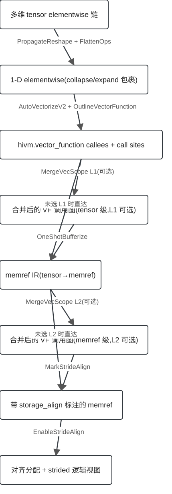
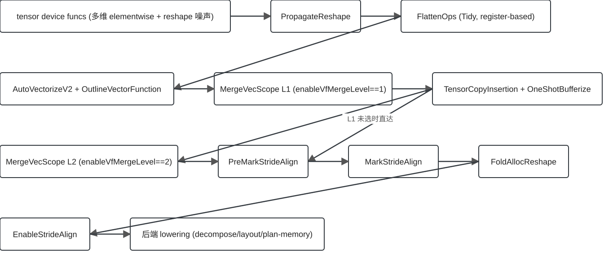
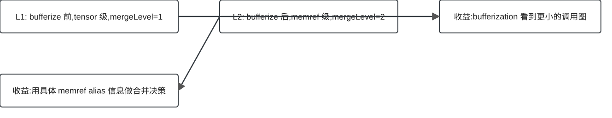

## 为什么需要这一整条 pipeline？

::: columns
::: {.column width="58%"}
前端交给后端的，是**带 reshape 噪声的多维 tensor elementwise 链**；RegBase(A5)硬件要的，是**跑在对齐 UB buffer 上的向量指令**。

这两个世界之间的差距，没有任何单一 pass 能补齐——所以有了这条链：

> **整形 → 向量化 → 合并 → 转表示 → 对齐**

每一级把上一级的输出，加工成下一级唯一认得的输入表示。
:::
::: {.column width="40%"}
::: {.callout-note appearance="simple"}
## 全链骨架
normalize → vectorize → merge(L1)→ bufferize → merge(L2)→ mark → enable

六个 requested pass，五个 context 阶段（SYS-EV-001..005 源码钉死顺序）
:::
:::
:::

## 心智模型：一条表示状态链

::: {.column width="58%"}
{.diagram}
:::
::: {.column width="40%"}
**六个 requested pass**（4 个 context 阶段图中作黑盒）：

PropagateReshape · FlattenOps · AutoVectorizeV2 · MergeVecScope · MarkStrideAlign · EnableStrideAlign

每个箭头是一次**表示变换**——图中共 8 个状态框（含输入态），L1/L2 是互斥的可选支路，不构成串行序列。
:::
:::
:::

## 端到端 transformation map

{.diagram .diagram-wide}

- 六个 requested pass 是本次深挖对象；其余 context-only 阶段按黑盒处理——TensorCopyInsertion/OneShotBufferize 只讲它的表示边界职责，其余见 child 材料
- MergeVecScope 的 L1/L2 是**互斥**双位置：`enableVfMergeLevel` 1 或 2，if/else（SYS-EV-003）

## Pass A+B：把形状变成"可向量化"的样子

::: columns
::: {.column width="58%"}
**PropagateReshape**（supporting）：把 collapse 滑向输出、expand 滑向生产者——先拆掉 reshape 障碍。

**FlattenOps**（core，Tidy+register-based）：把 elementwise 体压成 **1-D**，外部函数签名不变。

顺序是源码钉死的：`PropagateReshape → FoldTensorEmpty → CanonicalizeTensorReshape → FlattenOps`。FlattenOps 用 `hasUnpropagateableCase` 拒绝未清理的函数——**传播先于压平**不是偏好，是前提（SYS-EV-001）。
:::
::: {.column width="40%"}
::: {.callout-tip appearance="simple"}
## 交给下一级的契约
1-D elementwise 体，collapse/expand 包裹，签名不变 → 向量化在平坦 last-axis 域上规划
:::
:::
:::

## Pass C：建立 VF 单元（真实执行帧）

::: columns
::: {.column width="58%"}
**AutoVectorizeV2**：plan-then-apply——label → 分组 → transform 序列，在克隆上执行，函数级验证通过才提交；失败是**响亮**的（进程内回退 V1 已移除；`enableAutoVectorizeV2=false` 仍可显式选旧 V1 管线）。

紧跟的 **OutlineVectorFunction** 把融合环物化成 callees：

```mlir
func.func @test_..._outlined_vf_0(...)
    attributes {hivm.vector_function, no_inline}
```
:::
::: {.column width="40%"}
::: {.callout-note appearance="simple"}
## 为什么这条边成立
`hivm::isVF` 就是靠这个 attr 认出 merge 对象——**attr 即契约**（SYS-EV-012 执行帧；mergevecscope::EV-002）
:::
:::
:::

## 关键表示边界 + VF 粒度决策

{.diagram .diagram-wide}

- **L1**（bufferize 前）：tensor 级合并，bufferization 面对更小的调用图（SYS-EV-003）
- **L2**（bufferize 后）：memref 级合并，能用具体 alias 信息做决策
- 互斥由一个选项编码——这是整条链最重要的**跨 pass 决策**

## Pass D+E：对齐意图与对齐实现分离

::: columns
::: {.column width="58%"}
**MarkStrideAlign**（post-bufferization，memref 世界）：给 hivm op 的 UB 操作数打标注

```mlir
annotation.mark %alloc {hivm.stride_align_dims = array<i32: 0>,
                        hivm.stride_align_value_in_byte = array<i32: 32>}
```

**EnableStrideAlign**：统一需求（LCM/维），重新分配 + strided subview 保持逻辑形状：

```mlir
memref.alloc() {alignment = 64} : memref<...>
```
:::
::: {.column width="40%"}
::: {.callout-tip appearance="simple"}
## 为什么分两个 pass
标注是**每个 op 的意图**；对齐是**每个 alloc 的全局决定**。mark 是 enable 的唯一输入契约：缺标注/不等长 → 响亮报错；无标注 → no-op（SYS-EV-004, SYS-EV-006, SYS-EV-010/011）
:::
:::
:::

## 端到端走一遍（拼接帧 · 非单次执行）

| 帧 | 阶段 | 来源 | 证据 |
|---|---|---|---|
| 1 | flatten | 已执行：tidy-flatten 测试 | SYS-EV-013 |
| 2 | vectorize+outline | 已执行：auto-vectorize-v2 测试 | SYS-EV-012 |
| 3 | merge L1/L2 | child bundle 已执行 merge-vf-level-1/2 | mergevecscope::EV-015/016 |
| 4 | bufferize | **重构帧**（未执行） | SYS-EV-003 |
| 5 | mark | 已执行：mark-storage-align 测试 | SYS-EV-010 |
| 6 | enable | 已执行：median-kernel 测试 | SYS-EV-011 |

::: {.callout-warning appearance="simple"}
诚实声明：仓库里**没有**一个测试单次跑完整条链（SYS-EV-015）——上表是按 pass 拼接的真实帧，不是一次 end-to-end dump。
:::

## 系统级边界与已知限制

- **无全链测试**：例子是拼接的（SYS-EV-015）
- **旧 V1 管线仍可选**（`enableAutoVectorizeV2=false` 时走 V1）；但 AV2 失败后**进程内回退 V1 已被移除**，失败即响亮报错——两句话不矛盾：一个是管线选项，一个是失败语义（av2::EV-020）
- **PropagateReshape 的 HIVM 位不服务 regbase**（anti-regbase 条件）——它的参与是目标相关的（SYS-EV-009）
- **两个 flatten 是不同 pass**：`hfusion-flatten-ops` ≠ `hivm-flatten-ops`（SYS-EV-008）

## 记住这四点 + 到哪里下钻

1. **先整形再向量化**：1-D 形态是向量化的输入契约
2. **VF 粒度是可调决策**：L1/L2 双位置围绕 bufferization
3. **意图与实现分离**：mark → enable，tensor→memref 是最大边界
4. **端到端例子是拼接的**，不是一次完整执行

::: {.callout-note appearance="simple"}
下钻：每个 pass 的机制细节在其 child dossier/deck——MergeVecScope 已有 deck（`analysis/presentations/2026-09-08-mergevecscope-pass`），其余 child bundles 在 `analysis/explanations/`。证据索引见 handoff.evidence_index（36 条）。
:::
