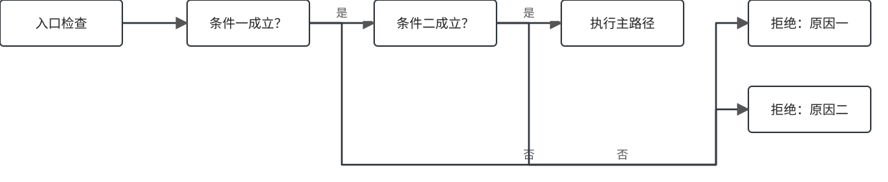
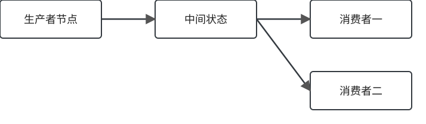
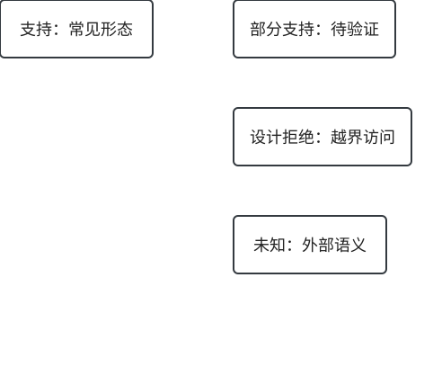

## 为什么需要这个 Pass？

::: {.claim}
用一句中文说清楚：它优化了什么，或修复了什么。
:::

::: columns
::: {.column width="62%"}
正文说明。不要把细节塞进标题或图中。
:::
::: {.column width="38%"}
::: {.callout-note appearance="simple"}
## 关键收益
指出最核心的一项机制或成本变化。
:::
:::
:::

## Pass 在哪里执行？

{.diagram .diagram-wide}

## 合并前 / 后

::: columns
::: {.column width="50%"}
### Before · 示意
```mlir
// before
...
```
:::
::: {.column width="50%"}
### After · 示意
```mlir
// after
...
```
:::
:::

## 核心流程

{.diagram}

## 依赖模型

{.diagram}

## 合法性与边界

{.diagram}

## 主要缺陷

| 问题 | 证据 | 后果 | 优先级 |
|---|---|---|---|
| 示例风险 | 观察到的实现行为 | 潜在失败模式 | **P0** |

## 改进建议

::: columns
::: {.column width="33%"}
### P0 · 正确性

- 改动
- 验证
:::
::: {.column width="33%"}
### P1 · 稳健性

- 改动
- 验证
:::
::: {.column width="33%"}
### P2 · 覆盖 / 收益

- 改动
- 度量
:::
:::

## 总结

- 一个架构本质。
- 一个主要风险。
- 一个最高优先级的下一步。
